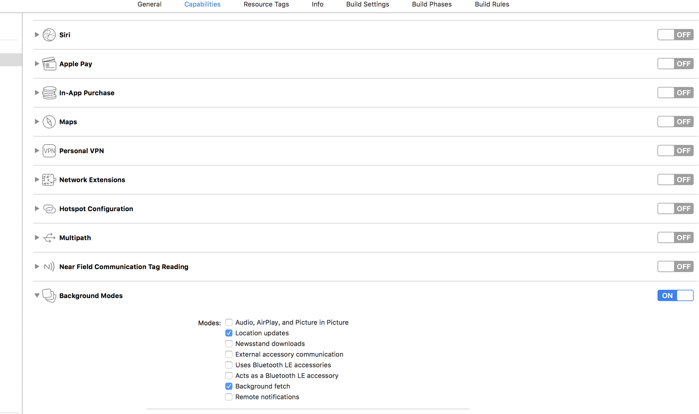
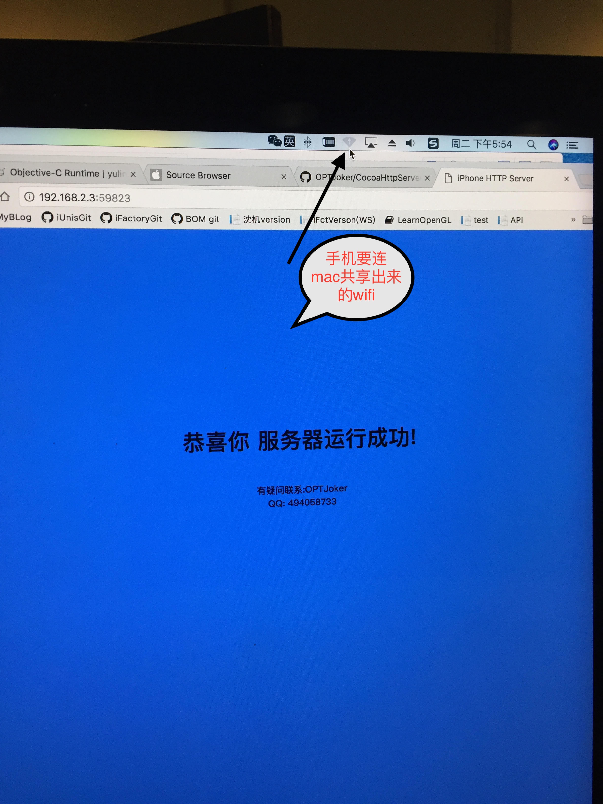

Tips:
1.新增依靠后台定位让app常驻后台的代码
2.新增webView页面显示web内容
3.新增iPhoneX适配


# CocoaHttpServer
利用开源库CocoaHttpServer搭建iOS手机本地服务器

直接从pod下载CocoaHttpServer，然后import <CocoaHttpServer.h>即可导入。

检测步骤：	
	
	1.运行该demo，从console控制台找到CocoaHttpServer生成的随机端口号(5位数)。
	
	2.打开safari浏览器，在地址栏输入："http://localhost:你的端口号" 即可。例：[http://localhost:55454]
	
	3.如果你想用电脑访问手机，那你需要让手机连电脑共享出来的wifi，然后在电脑浏览器里输入手机的ip地址(请自己从手机的设置页面查找你的ip),再加上端口号。
	
	4.如果成功，会看到浏览器内显示"恭喜你 服务器运行成功字样"。

API介绍：
```objc
	_localHttpServer = [[HTTPServer alloc] init]	//初始化一个本地服务器
	
	[_localHttpServer setType:@"_http._tcp."];`	//设置服务器类型
	
	[_localHttpServer setDocumentRoot:webLocalPath];	//指定本地服务器web root文件夹根目录（可以随意指定位置，也可在代码运行过程中改变目录）
	
	[_localHttpServer start:&error]		//启动服务器
	
	[_localHttpServer stop]		//停止服务器

	注：服务器一直启动会浪费资源，可根据需要随时开启或关闭服务器。`
```

注意:
1.需要开启xcode工程的后台定位设置才能启用app后台定位功能，不然会crash

2.必须让手机连接电脑共享出来的wifi才能让电脑访问。只让手机和电脑连同一个路由器是不行的。

1.2的处理如下图。



具体请看demo代码。<br>

推广博客链接:[http://blog.csdn.net/u012241552/article/details/49024749/](http://blog.csdn.net/u012241552/article/details/49024749/)
